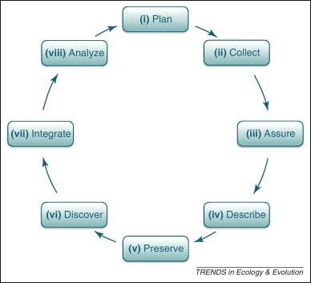

```{r setup, include = FALSE}
knitr::opts_chunk$set(cache = FALSE, 
                      echo = FALSE, 
                      message = FALSE, 
                      warning = FALSE,
                      #fig.height=6, 
                      #fig.width = 1.777777*6,
                      tidy = FALSE, 
                      comment = NA, 
                      highlight = TRUE, 
                      prompt = FALSE, 
                      crop = TRUE,
                      comment = "#>",
                      collapse = TRUE)
library(knitr)
library(kableExtra)
library(xtable)
library(viridis)

options(stringsAsFactors=FALSE)
knit_hooks$set(no.main = function(before, options, envir) {
    if (before) par(mar = c(4.1, 4.1, 1.1, 1.1))  # smaller margin on top
})
knitr::opts_chunk$set(echo = FALSE)
knitr::opts_knit$set(width = 60)
source("my_knitter.R")
#library(tidyverse)
#library(reshape2)
#theme_set(theme_light(base_size = 16))
make_latex_decorator <- function(output, otherwise) {
  function() {
      if (knitr:::is_latex_output()) output else otherwise
  }
}
insert_pause <- make_latex_decorator(". . .", "\n")
insert_slide_break <- make_latex_decorator("----", "\n")
insert_inc_bullet <- make_latex_decorator("> *", "*")
insert_html_math <- make_latex_decorator("", "$$")
## classoption: aspectratio=169
```


## Why is Data/Code Curation and Management Important?

In order for analyses to be repeatable, data and code first must:

- properly organized and documented
- accessibly stored and findable, and
- ideally, made available to others.

Data obtained with support from public funds (such as NSF or NIH) are usually ***required*** to be made available to other scientists and the public.


## Steps to Data Management

There are many steps to obtaining and effectively managing data (right, below). Today we talk about important components that fit in areas (ii) to (v).


::: columns
::: {.column width="45%"}

<br>

1. Manage Raw Data
1. Check Data
1. Store and Curate Data


:::

::: {.column width="55%"}

<center>
{width="70%"}
</center>


:::
:::

## 1. Manage Raw Data

So you’ve got some "raw" data:

- handwritten notes
- automatic data logger (this includes sequencing machines, temperature monitors, etc.)
- output from simulation

These data should be transferred to an organized electronic format and checked as soon as possible after collection.

## What Electronic Formats?

Often easiest to input as a table into a spreadsheet. 

But don’t leave it simply as a spreadsheet – save it to a non-proprietary format, like a comma-delimited file (csv).

<br>

## How should data be recorded

<center>
**`r myred("Input it in the least compact form that you can – you don’t want to lose information!")`**
</center>

<br>

Usually this means that you want your data to be in a "long" format -- but what does this mean?

## Long vs. Wide

## Metadata

## What is in a "row" of data?

- units separate from measured values
- dates
- individual measurements when possible
- separate columns for all covariates with units and settings recorded separately. 

## Examples from VectorByte


## Check Data

Almost always errors are made when data are being collected or inputted.

- Decimal points moved
- Digits switched
- Missing data are not properly encoded
- Instrument errors
- Skip some data

As (and after) you input, do some "sanity checks" 

- count/sum across rows and columns 
- check for empty fields
- visualize your data and look for outliers.


## FAIR Data Practices

