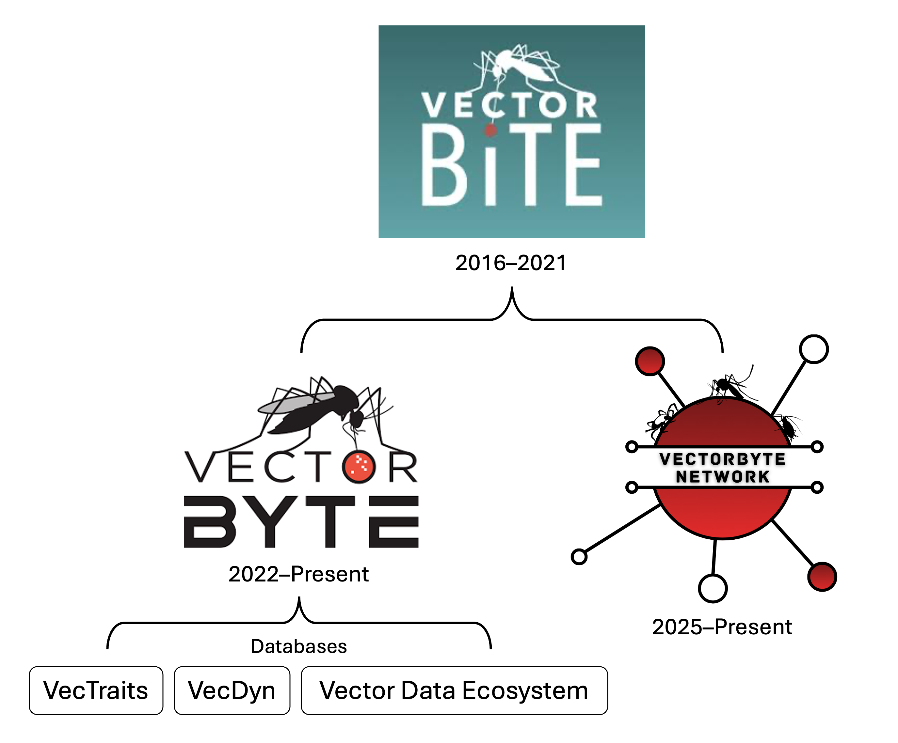

```{r setup, include = FALSE}
knitr::opts_chunk$set(cache = FALSE, 
                      echo = FALSE, 
                      message = FALSE, 
                      warning = FALSE,
                      #fig.height=6, 
                      #fig.width = 1.777777*6,
                      tidy = FALSE, 
                      comment = NA, 
                      highlight = TRUE, 
                      prompt = FALSE, 
                      crop = TRUE,
                      comment = "#>",
                      collapse = TRUE)
library(knitr)
library(kableExtra)
library(xtable)
library(viridis)

options(stringsAsFactors=FALSE)
knit_hooks$set(no.main = function(before, options, envir) {
    if (before) par(mar = c(4.1, 4.1, 1.1, 1.1))  # smaller margin on top
})
knitr::opts_chunk$set(echo = FALSE)
knitr::opts_knit$set(width = 60)
source("my_knitter.R")
#library(tidyverse)
#library(reshape2)
#theme_set(theme_light(base_size = 16))
make_latex_decorator <- function(output, otherwise) {
  function() {
      if (knitr:::is_latex_output()) output else otherwise
  }
}
insert_pause <- make_latex_decorator(". . .", "\n")
insert_slide_break <- make_latex_decorator("----", "\n")
insert_inc_bullet <- make_latex_decorator("> *", "*")
insert_html_math <- make_latex_decorator("", "$$")
## classoption: aspectratio=169
```


## Welcome!

The goal of the showcase is to introduce the community to our data resources, place them in the wider context of the world of VBD data resources, and get input to where the community would like to see these resources go next.

<center>
{width="40%"}
</center>


## Showcase Agenda

::: columns
::: {.column width="47%"}

Session 1: 

- History of VectorByte Initiative and Network
- VectorByte Resources
  - Website & Training 
  - VecTraits
  - VecDyn
- Vector Data Ecosystem
- UK Vector Data Hub
  


:::

::: {.column width="6%"}

:::

::: {.column width="47%"}

Session 2:

- Make breakout groups & introduce discussion prompts
- Snacks while discussing questions
- reconvene and report-out

:::
:::


## History -- VectorByte

- Began as the NIH/BBSRC supported **Vector** **B**ehavior **i**n **T**ransmission **E**cology **R**esearch **C**oordination **N**etwork (VectorBiTE RCN) in 2015
- Initially consisted of networking meetings, training, and initial development of databases
- ***VectorByte Initiative*** is the NSF funded project that grew out of this, focusing on development of publicly available databases and training workshops


## VectorByte Network

<center>
{width="60%"}
</center>

## New Network Growth

::: columns
::: {.column width="60%"}

- Brand new Network page through QUBES Hub to support future interactions, and support dissemination of resources
- Lorentz Center supported conference scheduled for next year
- Opportunities for other workshops, conferences, and training in the future (hopefully!)

::: 
::: {.column width="40%"}

<center>
Join Us! QR

</center>

:::
:::

## VectorByte Website & Resources

- ***Training Materials***: Freely available online resources on how to use and analyze data of the types that are housed in the databases, and affiliated software (e.g., `bayesTPC`)
- Databases 
  - ***VecTraits*** - data on (mostly thermal) traits of Vectors reported in a standardized format
  - ***VecDyn*** - observations of vector abundance across time and space, in a standardized format
- ***Vector Data Ecosystem***: Living guide to data resources for VDB systems

## Questions?


