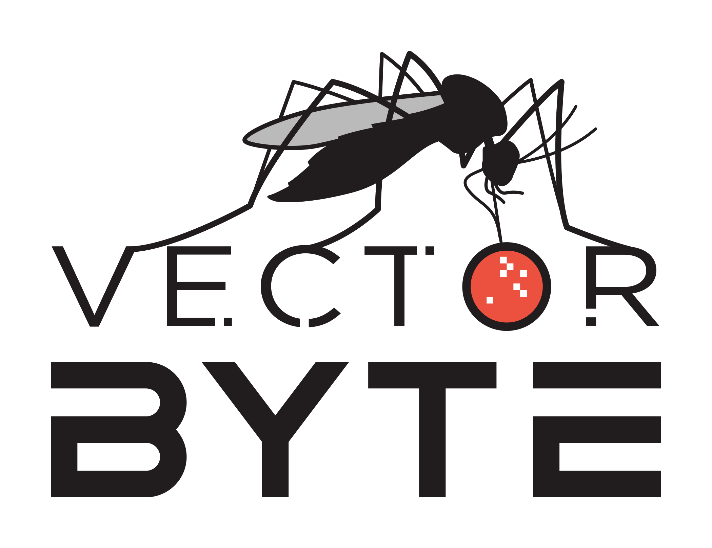
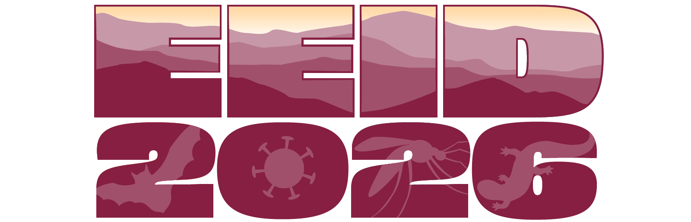

```{r setup, include = FALSE}
knitr::opts_chunk$set(cache = FALSE, 
                      echo = FALSE, 
                      message = FALSE, 
                      warning = FALSE,
                      #fig.height=6, 
                      #fig.width = 1.777777*6,
                      tidy = FALSE, 
                      comment = NA, 
                      highlight = TRUE, 
                      prompt = FALSE, 
                      crop = TRUE,
                      comment = "#>",
                      collapse = TRUE)
library(knitr)
library(kableExtra)
library(xtable)
library(viridis)

options(stringsAsFactors=FALSE)
knit_hooks$set(no.main = function(before, options, envir) {
    if (before) par(mar = c(4.1, 4.1, 1.1, 1.1))  # smaller margin on top
})
knitr::opts_chunk$set(echo = FALSE)
knitr::opts_knit$set(width = 60)
source("my_knitter.R")
#library(tidyverse)
#library(reshape2)
#theme_set(theme_light(base_size = 16))
make_latex_decorator <- function(output, otherwise) {
  function() {
      if (knitr:::is_latex_output()) output else otherwise
  }
}
insert_pause <- make_latex_decorator(". . .", "\n")
insert_slide_break <- make_latex_decorator("----", "\n")
insert_inc_bullet <- make_latex_decorator("> *", "*")
insert_html_math <- make_latex_decorator("", "$$")
## classoption: aspectratio=169
```


## Welcome!

This is a joint training workshop hosted by the Vector Byte Initiative and the Ecology and Evolution of Infectious Diseases Conference.

::: columns
::: {.column width="50%"}

<center>
{width="80%"}
</center>

:::

::: {.column width="50%"}

<br>
<br>

<center>
{width="100%"}
</center>


:::
:::

## History -- EEID

- First meeting in 2003 (Penn State)
- Has occurred annually after that
- A subset of these meetings has included training workshops (mostly late 2000s) but they have been brought back for the last 3 meetings (Stanford, Notre Dame, VT)


## History -- VectorByte

- Began as the NIH/BBSRC supported **Vector** **B**ehavior **i**n **T**ransmission **E**cology **R**esearch **C**oordination **N**etwork (VectorBiTE RCN) in 2015
- Initially consisted of networking meetings, training, and initial development of databases
- ***VectorByte Initiative*** is the NSF funded project that grew out of this, focusing on development of publicly available databases and training workshops

## EEID and VectorByte Training

<br>

This is the second year that the EEID and VectorByte trainings have been co-located, and VectorByte provided some of the training for EEID 3 years ago. 

<br>

This year, we've integrated them further to allow more opportunities for networking, and to leverage our extended expertise at Virginia Tech.


## Schedule

::: columns
::: {.column width="53%"}

**Saturday/Sunday** (8:30am - 5:30pm): 

  - Session 1 (joint on Sat.)
  - Break (joint)
  - Session 2 (joint on Sat.)
  - Lunch (joint)
  - Session 3 (divided)
  - Break (joint)
  - Session 4 (divided)

::: 

::: {.column width="2%"}

<br>
   
:::

::: {.column width="45%"}

**Monday** (8:30am - 1:00pm): 

  - Session 1 (divided)
  - Break (joint)
  - Session 2 -- Presentations (joint)
  - Lunch (joint)

More detailed schedules are on the respective training websites.

:::
:::


## Logistics

- All joint sessions will occur in the large meeting room
- breaks and lunch will be held in the lobby areas on the first floor of Steger
- VectorByte sessions: Steger 118
- EEID sessions: Steger 325

## Meet the Teams


## VectorByte Showcase

<br>

Interested in learning more about data resources for VBD systems or more networking? 

Sign up for the ***VectorByte Showcase***:

- 1:30 - 4:00pm
- Steger Auditorium and Lobby (where we are now)
- Food and networking

## Questions?


