```{r setup, include = FALSE}
knitr::opts_chunk$set(cache = FALSE, 
                      echo = FALSE, 
                      message = FALSE, 
                      warning = FALSE,
                      #fig.height=6, 
                      #fig.width = 1.777777*6,
                      tidy = FALSE, 
                      comment = NA, 
                      highlight = TRUE, 
                      prompt = FALSE, 
                      crop = TRUE,
                      comment = "#>",
                      collapse = TRUE)
library(knitr)
library(kableExtra)
library(xtable)
library(viridis)

options(stringsAsFactors=FALSE)
knit_hooks$set(no.main = function(before, options, envir) {
    if (before) par(mar = c(4.1, 4.1, 1.1, 1.1))  # smaller margin on top
})
knitr::opts_chunk$set(echo = FALSE)
knitr::opts_knit$set(width = 60)
source("my_knitter.R")
#library(tidyverse)
#library(reshape2)
#theme_set(theme_light(base_size = 16))
make_latex_decorator <- function(output, otherwise) {
  function() {
      if (knitr:::is_latex_output()) output else otherwise
  }
}
insert_pause <- make_latex_decorator(". . .", "\n")
insert_slide_break <- make_latex_decorator("----", "\n")
insert_inc_bullet <- make_latex_decorator("> *", "*")
insert_html_math <- make_latex_decorator("", "$$")
## classoption: aspectratio=169
```

## Introduction to Traits - Objectives

<br>

• Define a “trait”

• Understand the role of traits (and their variation) in VBDs

• Discuss how traits can be incorporated into VBD predictions

## What is a vector?

Any agent which carries and transmits an infectious agent between hosts

<center>
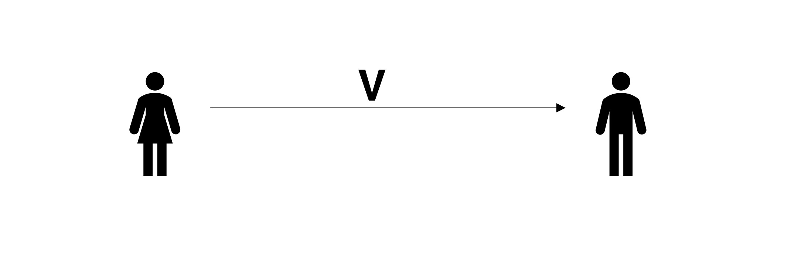
</center>

## What kinds of animals are vectors?

Many! Although arthropods are most commonly studied

<center>
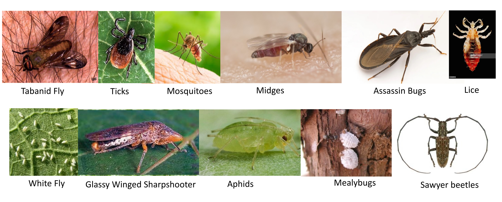
</center>

## Overview of VBD Transmission

Mechanical Transmission

::: columns
::: {.column width="50%"}

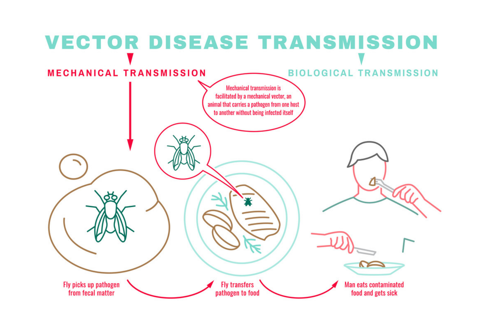{width="99%"}

:::
::: {.column width="50%"}


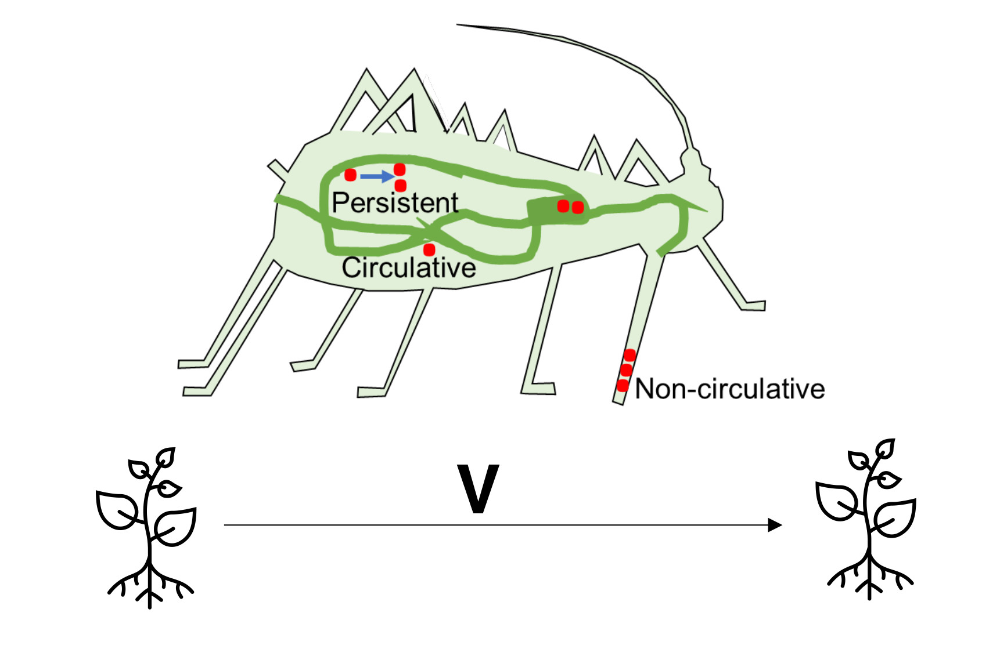{width="99%"}

:::
:::

## Overview of VBD Transmission

Biological Transmission


::: columns
::: {.column width="50%"}

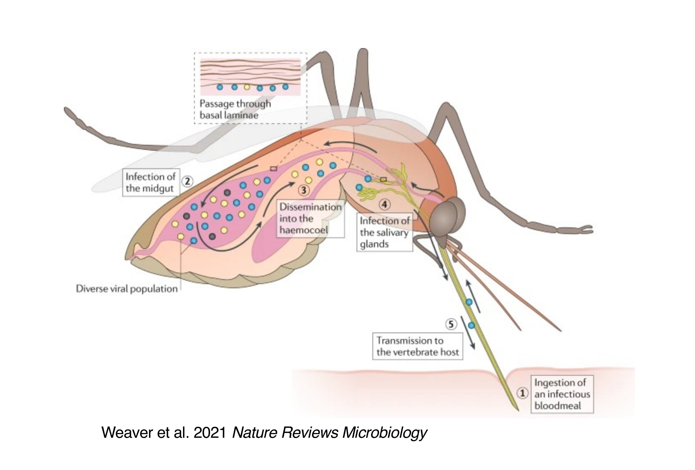{width="99%"}

:::
::: {.column width="50%"}


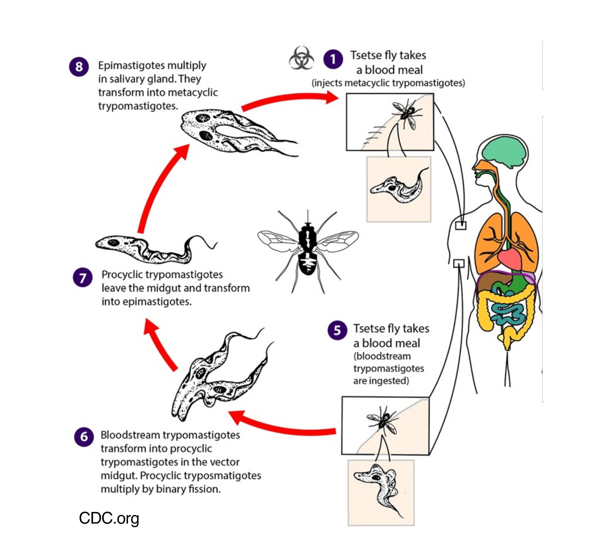{width="99%"}

:::
:::
-----------------------------------------------------------------------

<center>
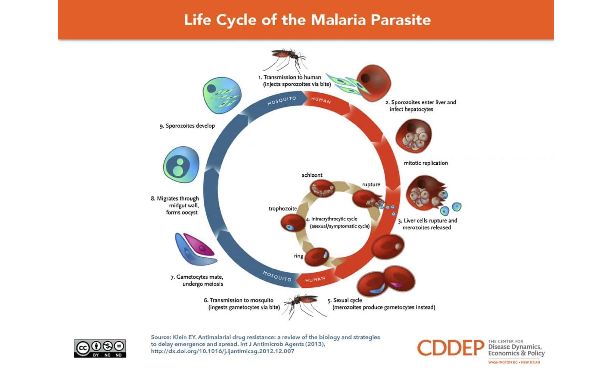
</center>

-----------------------------------------------------------------------


Pathogens undergo obligate develoment in the mosquito 
<center>
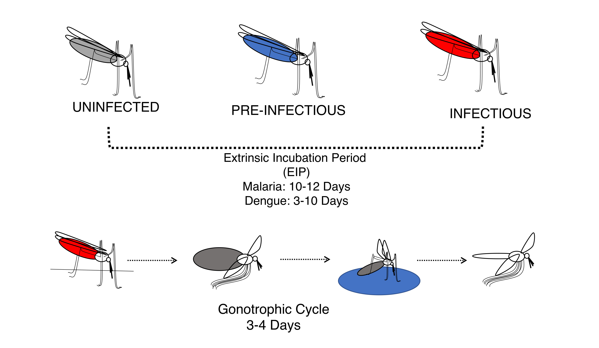
</center>

## VBD Transmission is the Intersection of Two Cycles 

Intrinsic and Extrinsic Incubation Periods 
<center>
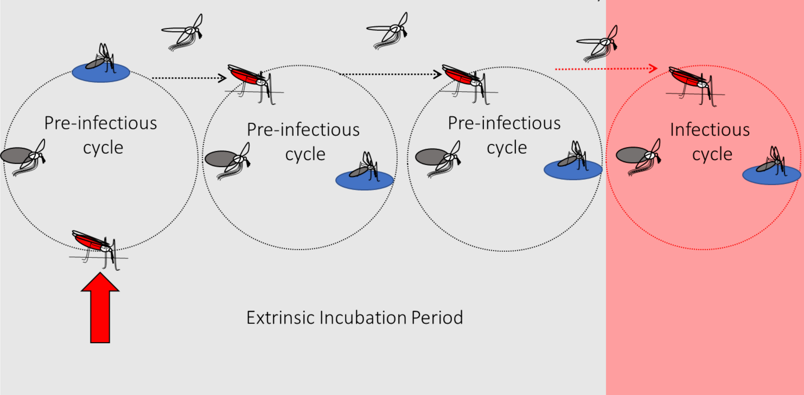{width="85%"}
</center>

-----------------------------------------------------------------------

<center>
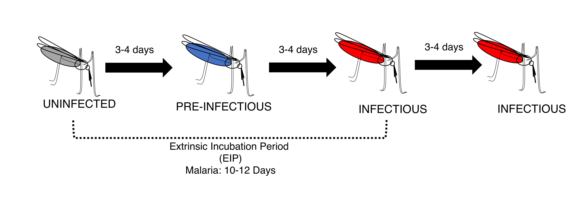
</center>

What elements do we need to include?

## What is a Trait?

***Any measurable feature of an individual organism***

<br>

*Functional traits* 

$\Rightarrow$ feeding rate, size, metabolic rate, eggs per day

<br>

*Behavioral traits* 

$\Rightarrow$  questing, host/food preference, thermal regulation, site selection

## Variability in Traits

<br>

<center>
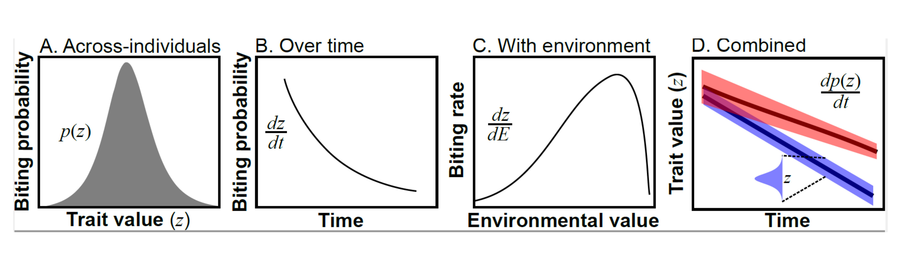
</center>                       

-----------------------------------------------------------------------

We can get more complex/realistic models...

<center>

</center>

-----------------------------------------------------------------------

But with every parameter added, more data is needed!

<center>

</center>

-----------------------------------------------------------------------

<center>

</center>

## $R_0$: Directly-Transmitted Pathogen

<center>
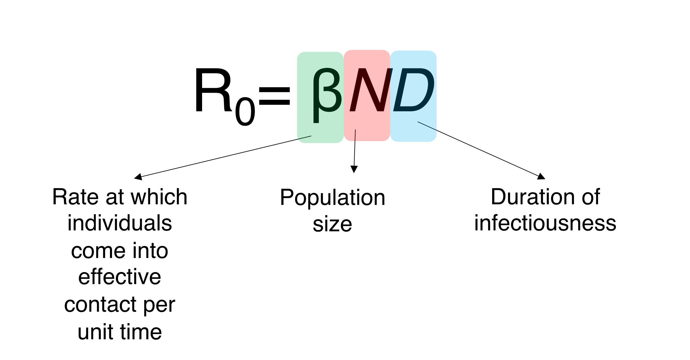
</center>

## $R_0$: Vector-Borne Pathogen

<center>
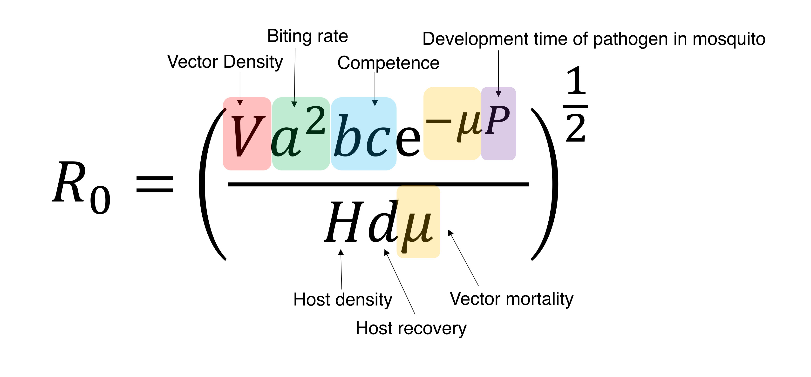
</center>

## Thermal Performance Curves (TPCs)

::: columns
::: {.column width="40%"}

<br>

- Vectors of interest are typically ectothermic

- Biological reactions typically go faster as temperature increases

::: 
::: {.column width="60%"}

<center>

</center>
:::

:::

## But there's a limit!

<center>
{width="80%"}
</center>


-----------------------------------------------------------------------

::: columns
::: {.column width="50%"}

- Nearly every aspect of life history is influenced by temperature

- We want to include parameters in relation to temperature

- Biologically meaningful models

- Old assumptions were linear        

- Unimodal curves are more realistic 

::: 
::: {.column width="50%"}

<center>
{width="75%"}
{width="75%"}
</center>
:::

:::

------------------------------------------------------------------------

Different traits have different curves

<center>

</center>

------------------------------------------------------------------------

Thermal limits are useful for predictions and mapping

## Estimating TPCs

TPCs are derived using empirical data from laboratory experiments.

<center>
{width="70%"}
</center>

## Need to Collect Data Across a Thermal Gradient

<br>

- Ideally want to capture data across a wide thermal gradient
- Need enough temperatures to estimate minimum, maximum, and optimum values

## Fitting TPCs

TPCs can have many possible shapes:

<center>
{width="75%"}
</center>

## Model Validation

Data from the field or other experiments can help validate estimates.

<center>
{width="65%"}
</center>
