```{r setup, include = FALSE}
knitr::opts_chunk$set(cache = FALSE, 
                      echo = FALSE, 
                      message = FALSE, 
                      warning = FALSE,
                      #fig.height=6, 
                      #fig.width = 1.777777*6,
                      tidy = FALSE, 
                      comment = NA, 
                      highlight = TRUE, 
                      prompt = FALSE, 
                      crop = TRUE,
                      comment = "#>",
                      collapse = TRUE)
library(knitr)
library(kableExtra)
library(xtable)
library(viridis)

options(stringsAsFactors=FALSE)
knit_hooks$set(no.main = function(before, options, envir) {
    if (before) par(mar = c(4.1, 4.1, 1.1, 1.1))  # smaller margin on top
})
knitr::opts_chunk$set(echo = FALSE)
knitr::opts_knit$set(width = 60)
source("my_knitter.R")
#library(tidyverse)
#library(reshape2)
#theme_set(theme_light(base_size = 16))
make_latex_decorator <- function(output, otherwise) {
  function() {
      if (knitr:::is_latex_output()) output else otherwise
  }
}
insert_pause <- make_latex_decorator(". . .", "\n")
insert_slide_break <- make_latex_decorator("----", "\n")
insert_inc_bullet <- make_latex_decorator("> *", "*")
insert_html_math <- make_latex_decorator("", "$$")
## classoption: aspectratio=169
```

## Overview of VectorByte

- VectorBiTE RCN
- VectorByte $\Rightarrow$ two databases
- VecDyn and VecTraits

## VecDyn

- Vector abundance
- Typically field-collected surveillance data

<center>
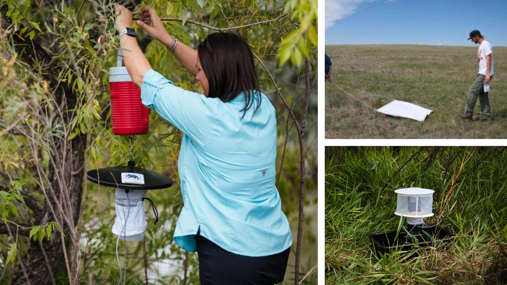{width="70%"}
</center>

## VecTraits

- Biological trait data
- Typically results from controlled laboratory experiments

<center>
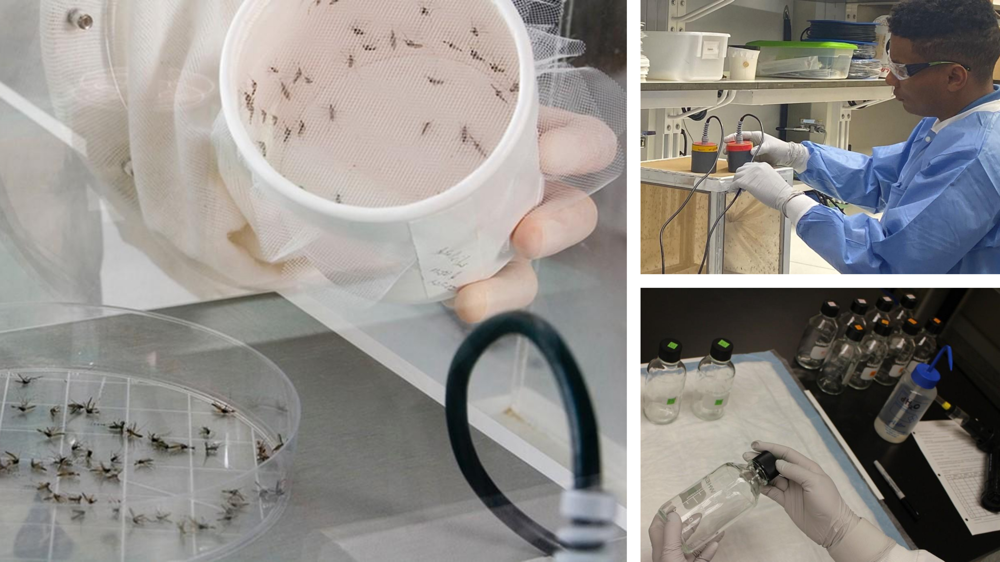{width="70%"}
</center>

## Vector Trait Data

Vector trait: measurable biological aspects of life-history, behavior, or vector competence

<br>

::: columns
::: {.column width="45%"}


- Because we are dealing with ectothermic vectors, these are often measured against temperature in controlled laboratory environments


::: 
::: {.column width="55%"}

<center>
{width="100%"}
</center>
:::

:::

## Examples of Studies

<center>
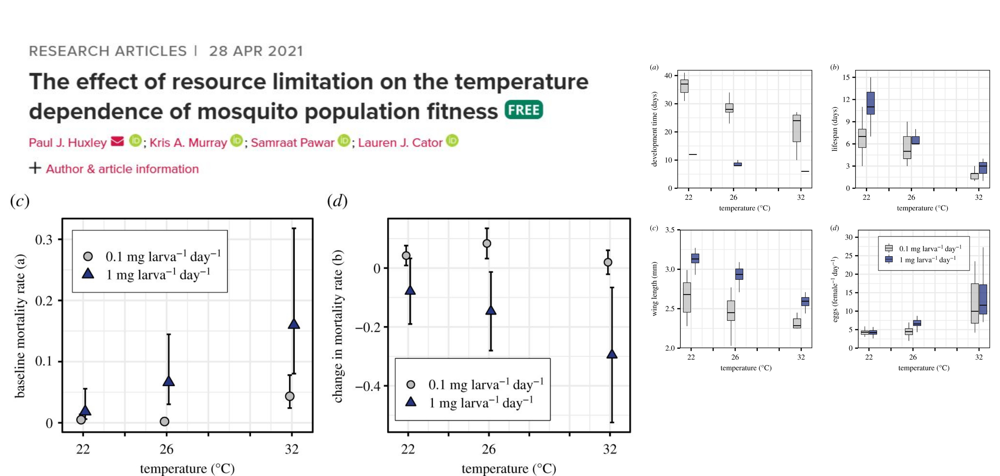
</center>

------------------------------------------------------------------------

<center>
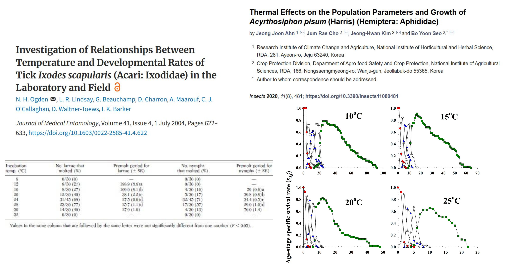
</center>

## Flexible Framework

- VecTraits template provides a starting point
- Required fields
- Commonly used fields
- Each column has data format requirements (e.g., text, numeric, etc)
- NO strict format for most study aspects (e.g., units used in study, taxonomy)
- Can be expanded as needed to accommodate study designs with more interactors

## VecTraits Column Definitions

<center>
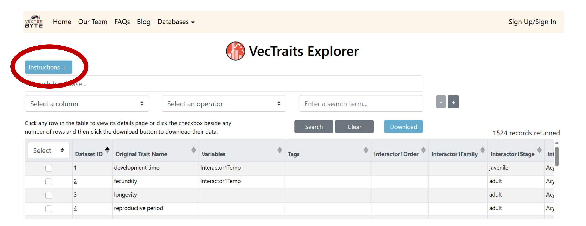
</center>

------------------------------------------------------------------------

<center>
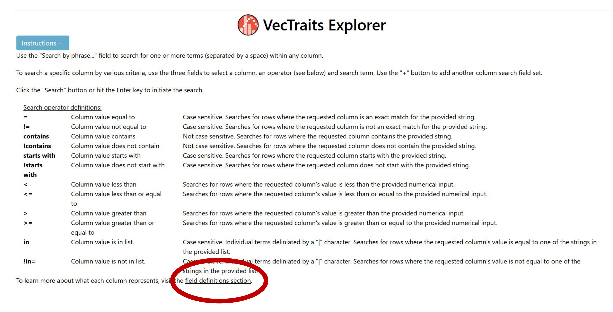
</center>

------------------------------------------------------------------------

<center>
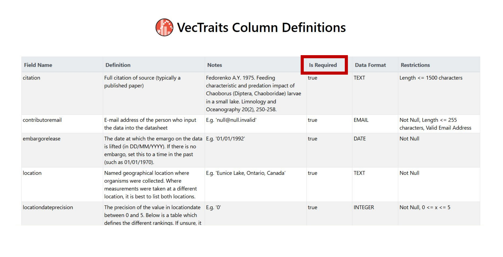
</center>

## VecTraits Required Columns

A minimum set of columns required in the dataset for successful upload

<br>

***These cannot be missing***

<br>

They should include all available data

<br>

If a required column is missing, file may fail to upload without any error

## VecTraits Required Columns

::: columns
::: {.column width="50%"}

- Original Trait Value
- Original Trait Unit
- Original ID
- Location
- Location Date Precision

::: 
::: {.column width="50%"}


- Submitted By
- Contributor Email
- Citation
- Embargo Release

:::
:::

## More Column Definitions
- Original Trait Name: trait as named in source
- Original Trait Def: definition of trait as named in source
- Original Error: error recorded in study (additional column for units)
- Interactor1: lowest taxonomic identity of main study organism 
- Interactor1 Number: if grouped, number of individuals (i.e., experiment sample size)
- Interactor1 Temp: experimental temperature (additional column for units)


## More Column Definitions
- Interactor2: lowest taxonomic identity of additional organisms in experiment
*Note: can be expanded to accomodate experimental design*
- Second Stressor: additional experimental factors (e.g., CO2)
- Notes: any additional information not captured with existing fields

## Where to Find Template and Instructions

- Note: *Must be logged into VectorByte account*

<center>
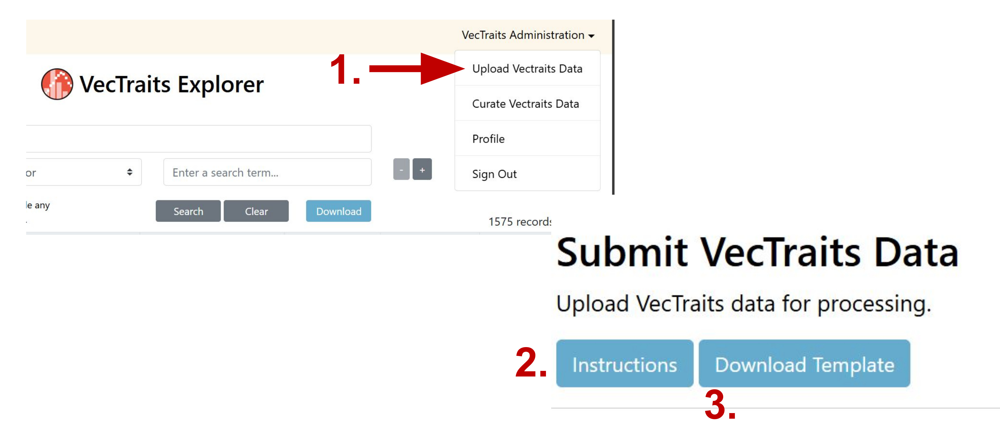{width="80%"}
</center>

## VecTraits Template

<center>
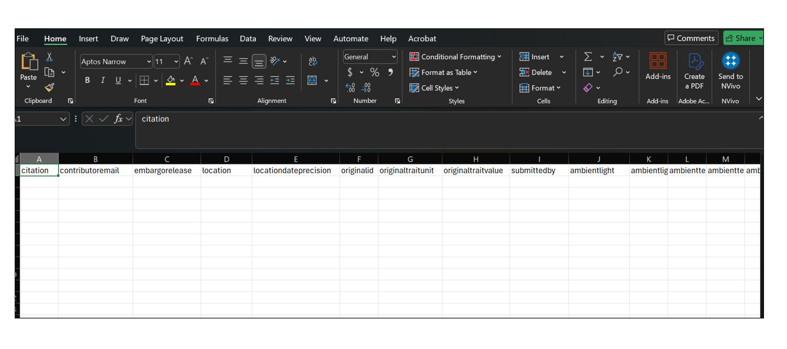
</center>


## Formatting Your Data

- Do not need to natively format experimental data for VecTraits
- Should still adhere to minimum information standard (MIReVTD)
<center>
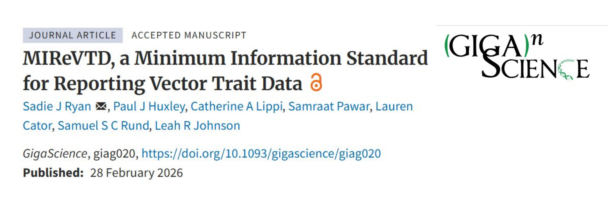
</center>


## Study Traits

- What is the main trait or outcome being measured in your study?
- Sometimes multiple traits measured at once
- May require formatting into separate datasets

## Individual Observations vs Grouped Data

- How were data recorded in the study?
- Individual measurements
- Group averages (include sample sizes!)
- Repeated measurements

## Formatting Dates

- Most fields do not have strict formatting guidelines to ensure flexibility
- Dates are an exception
- There could be errors due to ambiguity based on localization
- For example, 5/2/2021 could refer to the 5th of February or the 2nd of May 
- The desired date format is YYYY-MM-DD 
- This is the only way to minimize errors and guarantee that dates are recorded as expected


## Study Parameters

- Record all controlled aspects of experiment
- Anything that was manipulated in the study (e.g., temperature, humidity, food concentration)
- Ideally enough information to replicate experiment

## Other Experimental Stressors

- Some studies may include other factors in addition to trait and main experimental parameters (e.g., temperature)
- Some common examples are CO2 concentrations or pesticide exposure

## Vector Taxonomy

::: columns
::: {.column width="50%"}

- Full taxonomic grouping in study/paper $\rightarrow$ ‘interactorx’ column
- Can include information on subspecies, species complex, biotype, etc
- Dedicated columns for taxonomic groupings (Kingdom, Phylum, etc.)

::: 
::: {.column width="50%"}

- ‘interactorxspecies’ column should only contain specific epithet
- Add additional interactors (e.g., interactor2...) with associated taxonomy for other organisms in study
- Interactors may include pathogens, hosts, and plants

:::
:::

## Laboratory Conditions

- What factors were controlled in the laboratory?
- These need to be recorded!
- Ambient holding temperature, relative humidity, photoperiod, rearing temperature, feeding concentrations, etc.
- Anything that was not an experimental parameter, but still controlled or recorded as part of the experiment

## Geographic Information

- GPS coordinates or location description of where field-collected specimens orginate
- DO NOT put location of laboratory or facility where experiment was conducted
- DO NOT put coordinates for established lab colonies
- These details can be recorded in other fields

## Additional Interactors

- Interactor1 is typically the vector being studied
- Additional interactors can be recorded for other named organisms in study
- The VecTraits template can be expanded to accommodate additional species
- These may include parasites, hosts, viruses, plant substrate, etc

## Digitizing Trait Data

- Full data not always available
- Try to contact study authors
- Some data and results are only provided in tables and figures

## Digitizing Published Studies

- Check supplemental materials first
- Consider reaching out to CA
- Identify where requisite data are in paper
- Tables are typically easier
- Make sure to check text!
- Make sure figures are displaying unique data
- Check for data that will ensure usability (e.g., sample sizes, error, etc)

## Manual Digitization

- Time consuming
- May not be practical for large groups
- Great deal of control
- Issues with agreement between digitizers
- More of an issue when digitizing figures

## Figure Digitization Tools

::: columns
::: {.column width="50%"}

- PlotDigitizer (`plotdigitizer.com`)
- GraphReader (`www.graphreader.com`)
- WebPlotDigitizer (`automeris.io`)

<center>
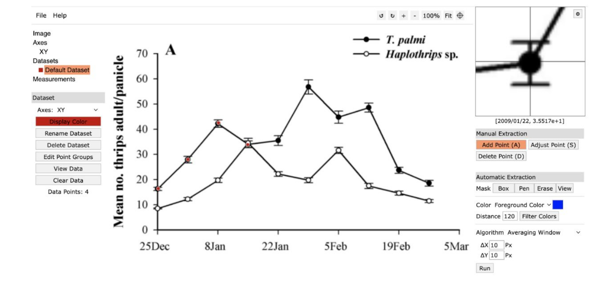{width="80%"}
</center>

::: 
::: {.column width="50%"}

<center>
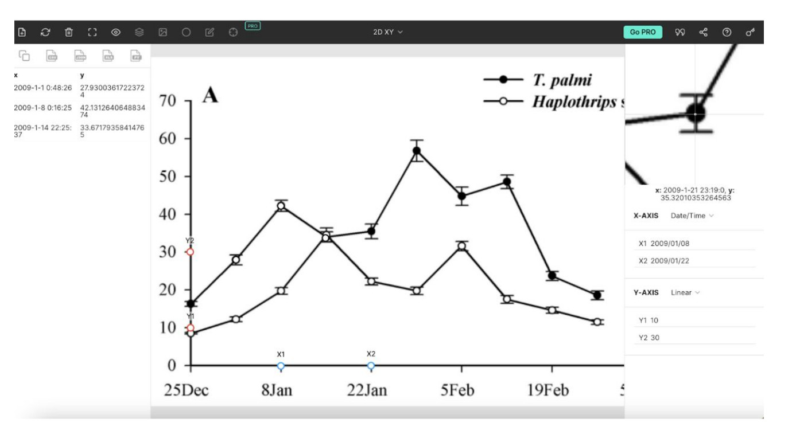{width="75%"}

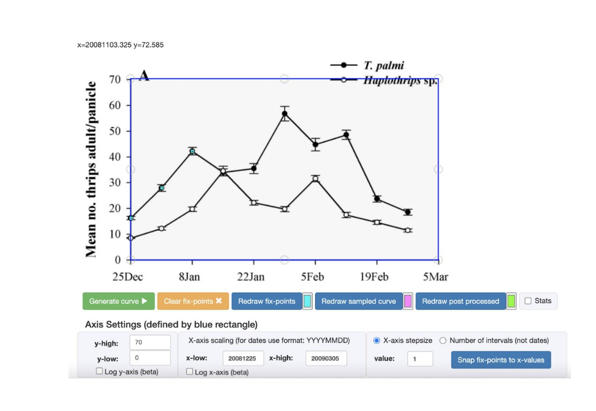{width="85%"}
</center>
:::
:::

## Finding Data in VecTraits

<center>
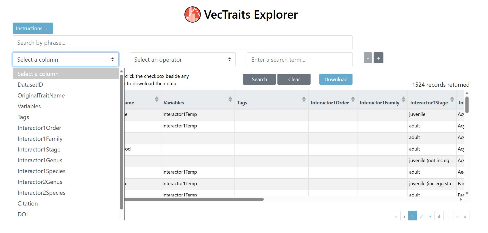
</center>

------------------------------------------------------------------------

<center>
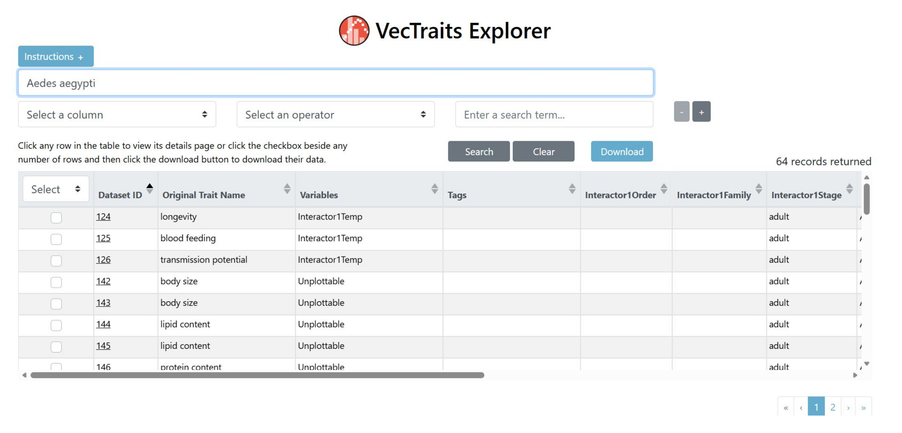
</center>

## Downloading Data from VecTraits
<center>
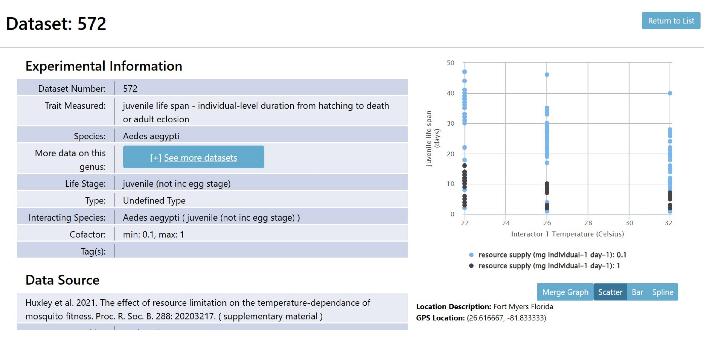
</center>

------------------------------------------------------------------------

<center>
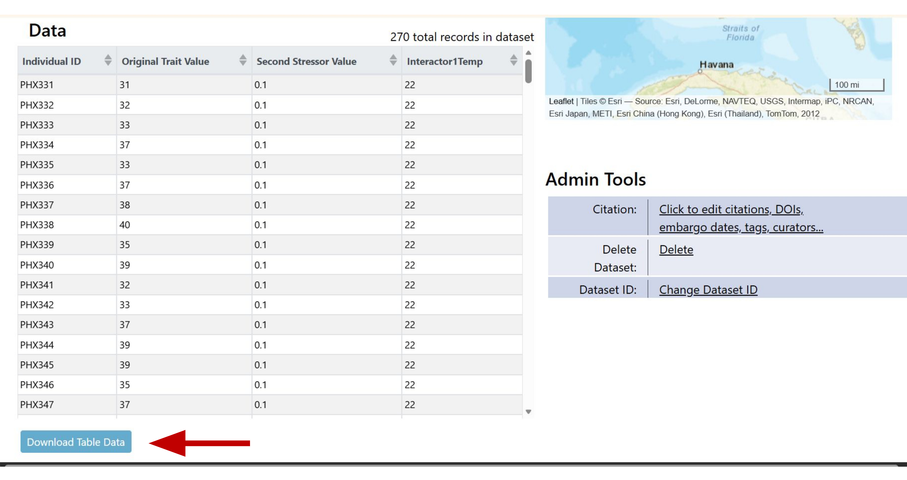
</center>

## Contributing Data to VecTraits

<center>
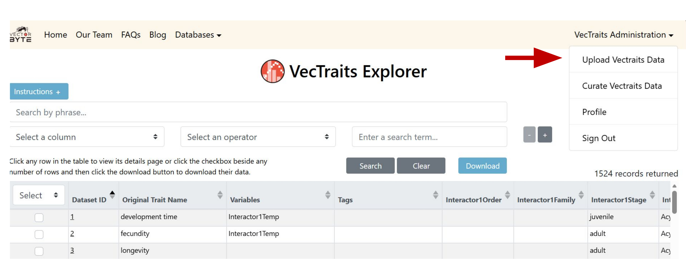
</center>

## Common Sources of Upload Errors

- Missing required columns
- Special characters and accents (e.g., check citations, units, and names)
- Incorrect character type for column (e.g., characters in numeric)
- Autofill for unique ID or citation columns (e.g., spreadsheet autofill options will increase numbers incrementally)
- If there are multiple errors, may not get a specific warning

## Citing VecTraits/Data Ecosystem

- LR Johnson, L Cator, SSC Rund, SJ Ryan, PJ Huxley, and S Pawar. 2023. "VecTraits Explorer". University of Notre Dame. DOI: 10.7274/28020782
- SJ Ryan, LR. Johnson, CA Lippi, L Cator, S Pawar, and SSC Rund. 2023. "The Vector Data Ecosystem." University of Notre Dame. DOI: 10.7274/27854508 *or*
- CA Lippi, SSC Rund, SJ Ryan, Characterizing the Vector Data Ecosystem, Journal of Medical Entomology, Volume 60, Issue 2, March 2023, Pages 247–254 

For more info: `www.vectorbyte.org/blog/how-to-cite-us`

------------------------------------------------------------------------
<center>
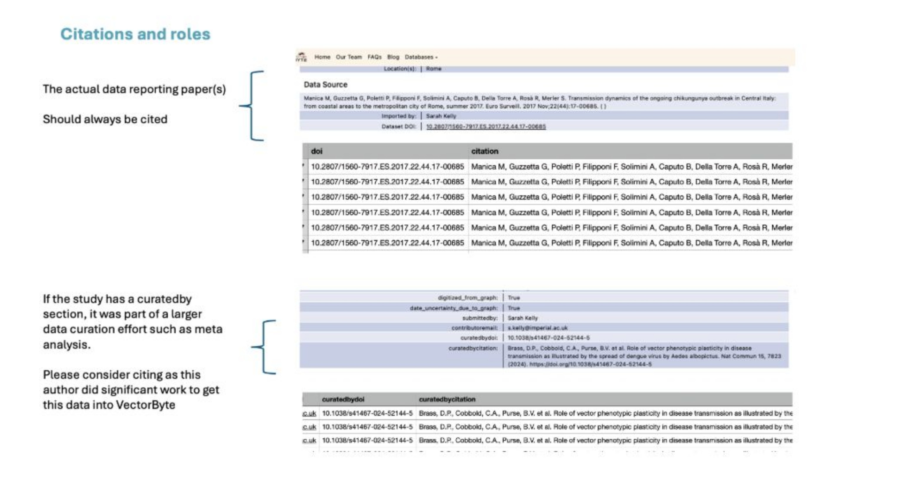
</center>
