# Section 1. Choice and Acquisition

## Choice

Before you dive into products, or just do what someone else did, think about the biological mechanisms you might be exploring. Think about what meteorological or climate data corresponds to the mechanism.

Example: mosquitoes (pick your species of choice)

-   When does temperature limit your mosquito of interest, and how?

    -   Is minimum temperature likely to be most important?

    -   What about maximum temperature?

Create reasonable hypotheses for mechanistic processes

Think about how these differ among temperate vs. tropical vs. boreal

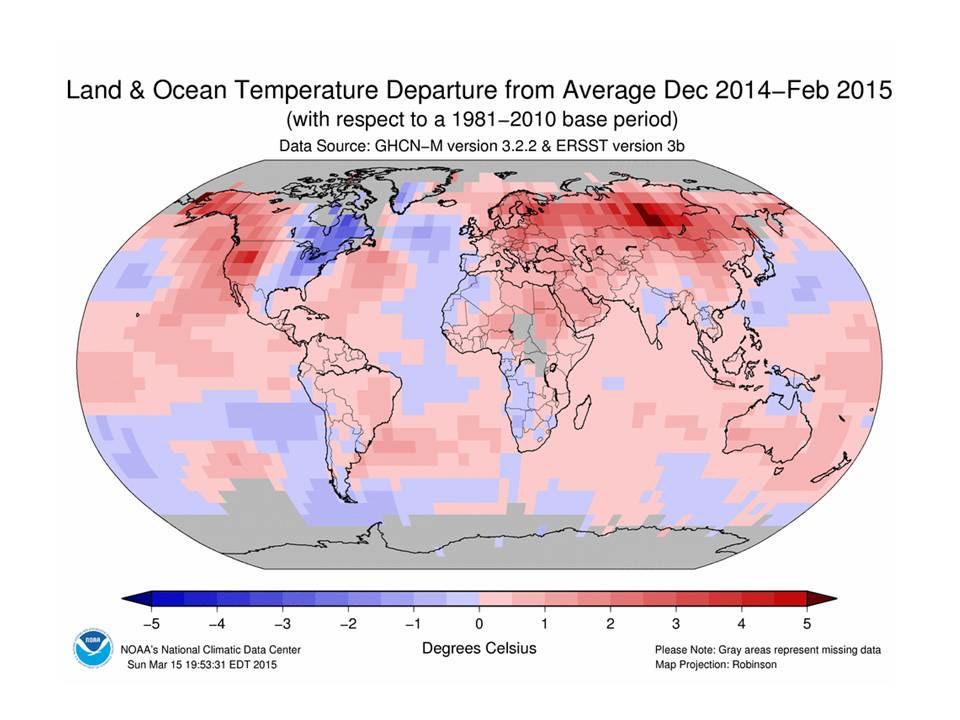

## Scale

You’ve decided minimum temperature will be important, but when and for how long?

For example, think about temporal scale:

-   Do you need to know the temperature of the coldest month? Minimum temperature in an hour in a day?
-   First month in which a daily minimum temperature is exceeded? (Thresholds)
-   Average v. cumulative measures (think temperature and precipitation)

We also think about spatial scale. A bit of Tobler’s law –- how far does the effect carry (derived from the ‘law’ that things that are closer are more similar). So we think about various “geographic” considerations for met/climate variables:

-   Is the nearest weather station useful for your organism of interest, is interpolation of data reflecting the likely response at the location?
-   Where are measurements made?
-   Is ground surface temperature equivalent to air temperature, and when does it matter?
-   Does rain absorb into the surface or sit on it?

## Acquisition

Often we're going to need to focus on making the best of things.

Unless you have a weather station logging your variables of interest next to your trapping/collecting sites, you will use proxies in some way.

-   If your data are time series, you need regularly spaced, consistent observation or modeled products

-   Most ‘weather’ products are modeled (interpolated) in some way

    -   Read the documentation carefully, and know what it is

    -   Imperfect is often still useful, but may have important limitations

-   EOS products are also modeled, and spatiotemporal aggregations will also determine their utility

    Beware of apparent consistency

Today, we will be exploring the following:

-   Point extraction of Daymet data
    -   Useful for USA-based studies
    -   High frequency data availability
    -   Consistency already worked out for you.

**Before you even start**

-   What is the location of your vector time-series?

-   We assume absolutely perfect data, and chances are you have a coordinate pair

-   What projection is it in?

-   Whose GPS unit was it reported from?

-   How accurate or precise is it?

Throw it on Google maps and make sure it seems to be where you think it is.

------------------------------------------------------------------------

# Section 2: DAYMET point extraction example

## Choose a location

Put your point in Google maps, or choose an address. For example:

**29.6557572689658, -82.32141674790877**

What is this?

This is my house – 405 NE 5th Avenue, Gainesville, FL.

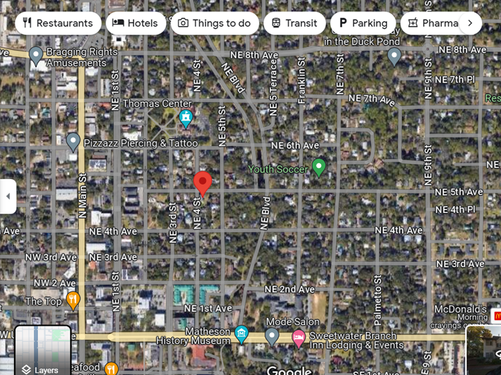

**Right click to get coordinates**

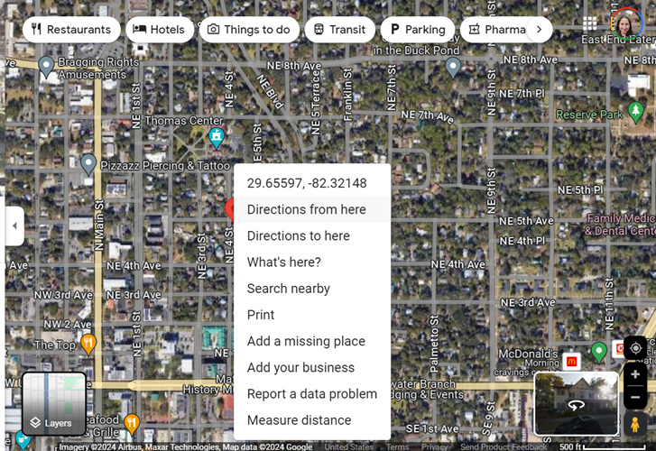

Earthdata profile with NASA – make yourself an account - https://urs.earthdata.nasa.gov/

## Then navigate to the DAYMET site

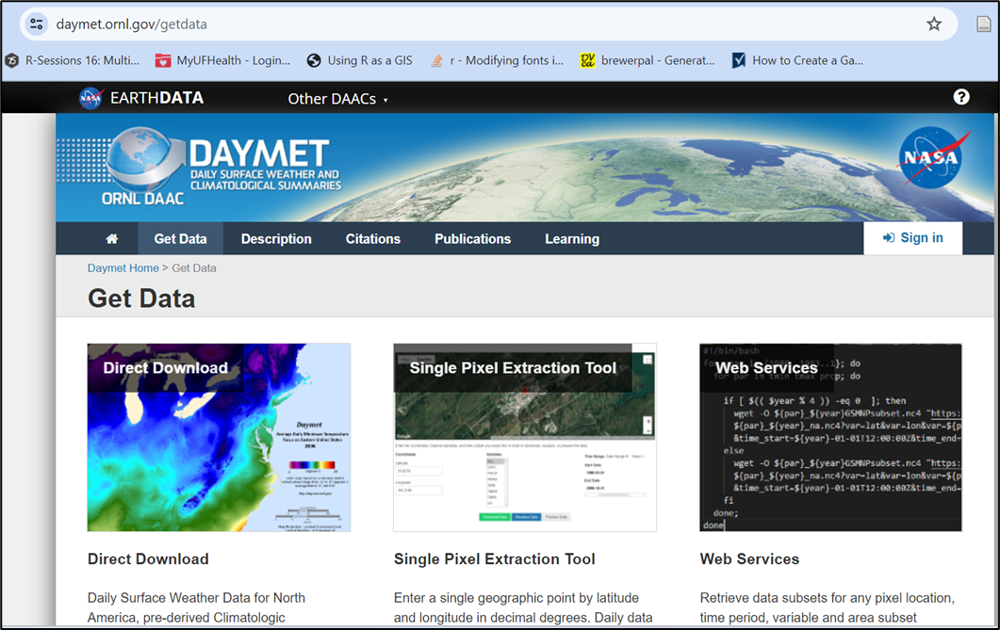


## Locate the Single Pixel Extraction Tool

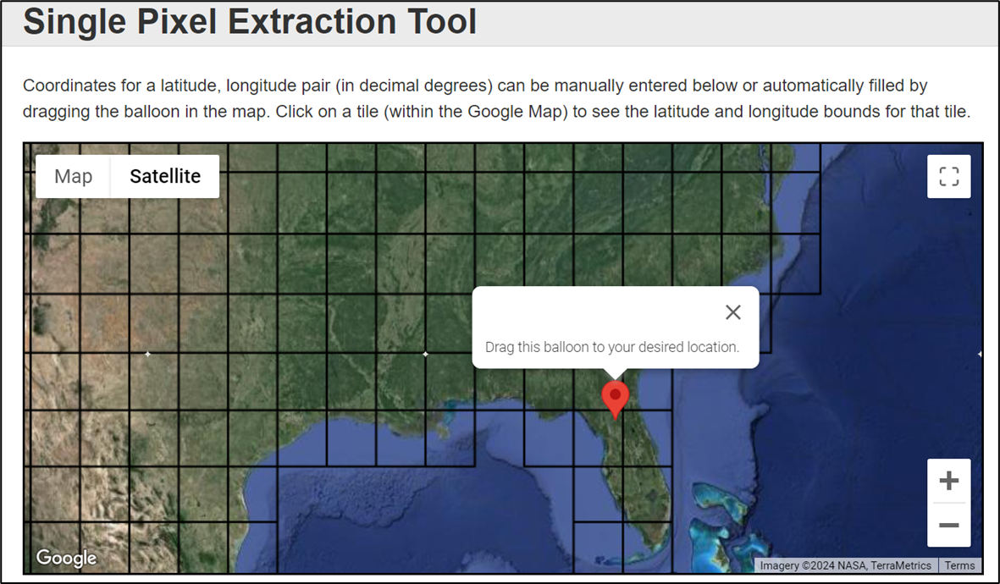

## Input your coordinates, or navigate to the location you want on their map

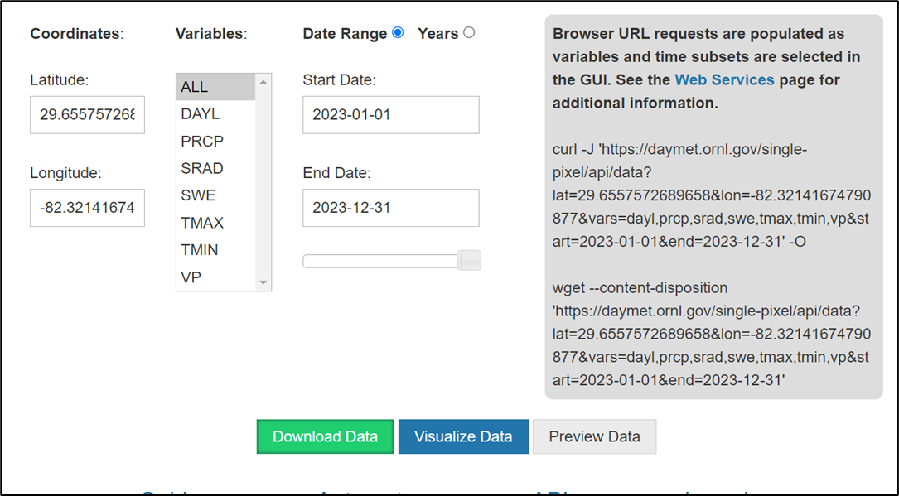

You will see lots of choices of variables - DAYL - day length, PRCP - precip, etc. Use the website itself and the references to publications of the model for this product to fully understand what the variables are and mean - remember, a daily minimum could mean the lowest recording in a given hour, or may have a different value for day and night within a 24 hour period.

Choose the timeline you are interested in to select your date range. Remember, at a single pixel, "accidentally" downloading too many variables or too many years is just a bigger text file, but not huge. If you are downloading modeled climate data across a region and make this sort of mistake in requests, you may either be waiting a while, or end up with unwieldy huge files. You can always return and re-download.

**DON’T OPEN YOUR DATA IN EXCEL – demo only for this workshop!**

Annoying/informational header lines will need to be examined and you can determine how to format your data from there.

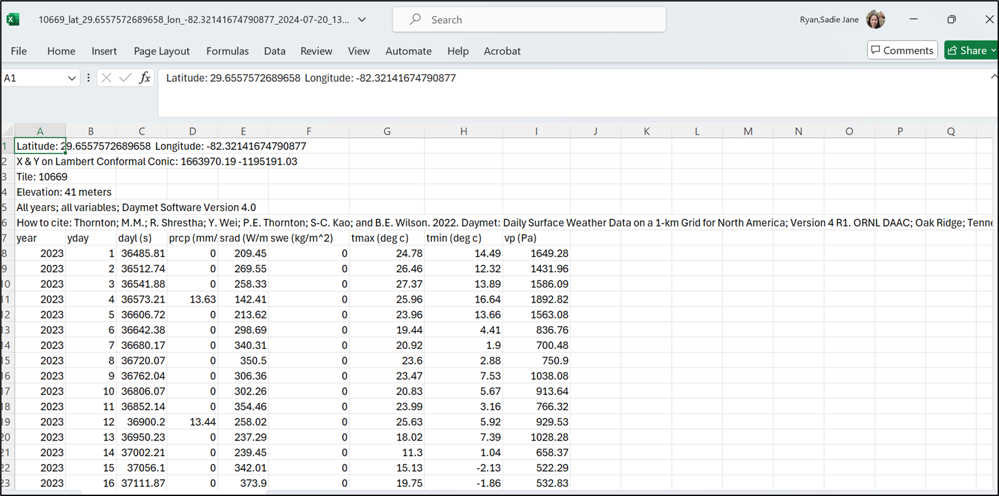

**User choice about how to wrangle it into R**

Be super careful about csv formats if you open in Excel, but you probably know this at this stage in your career. Generally, don’t. Just pull it into R and chop off rows or subset what you need, check the classes of each variable field you’ll use, make sure the units of measurement (temperature, VP, etc) are as you expect, and enjoy!

**Last notes for the DAYMET data pull**

For a single point, the question about what the projection is in the Daymet model should be ok, because you are not overlaying rasters, and you can see it all on google maps, both before and during your extraction

If you are doing this for multiple points, DEFINITELY THINK ABOUT THE PROJECTION

------------------------------------------------------------------------

Pause – were you able to navigate this so far?

Daymet is a bit deluxe – high resolution (pixels are small), high frequency (daily availability). Easy UIs for data extraction

Limitations: It is just a model (pulling in all the best station data available across multiple agencies) Only continental North America (plus HI from 1980 and PR from 1950)\
Seems to get released by calendar year (up to end of last year)

------------------------------------------------------------------------

## EXCERCISE! 

Head to VecDyn, find a dataset within the USA
What is its location?
What is the date range and frequency of data? 

Head to Daymet and pull the corresponding temperature and precipitation 

Plot these together in rough plots in R. 


# Section 3: Going Global - ERA-5 access

ERA 5 is a global reanalysis product served by Copernicus, the European Center for Medium Range Weather Forecasts (ECMRWF) - The CDS - Climate Data Store on Copernicus holds the ERA5 products. https://cds.climate.copernicus.eu/datasets

In this section, link you to a vignette to access ERA 5 that has been aggregated at admin level scales (GADM) for the globe by projects related to the UK VBD Hub. What you will find at present is access to these data for a project that explored patterns in COVID-19 in 2020-2021 or thereabouts; we are in discussions as to keeping this more up to date. Using this derived and aggregated dataset obviates the need to acquire and use an API Key from Copernicus. (https://ohvbd.vbdhub.org/reference/assoc_ad.html). Of key importance, areaData (and assoc_ad) is not a point based query, although you can query using Lat/Lon. Caveat emptor, you are querying an aggregated dataset, not pixel-level. The smallest admin area level here is approximately equivalent to a county. 

The following is your opportunity to run through the experience of acquiring the API key and working with data from ECMRWF through `R` - note that large NetCDF files are were not designed with R in mind, but it's getting better everyday. You will still see some surprising aspects, but hopefully you can get to the point of plotting a pretty map of one timeslice from a larger time series, and perhaps manipulating a time series for time-dependent use. 


```{r, message=FALSE, warning=FALSE}
library(terra) # to read the netCDF files
library(lubridate) # to deal with dates and times
library(dplyr) # to wrangle and tidy the data
library(tidyr) # to wrangle and tidy the data
library(ggplot2) # to make statis maps
library(gganimate) # to make a temporal gif of climate variation
library(ecmwfr) # to request data from Copernicus
library(sf) # to extract coordinates from spatial objects
library(rnaturalearth) #natural earth library, good for making spatial things
library(RNetCDF)
library(ncdf4)
library(stars)
library(tidyverse)
library(ggpubr)
library(tidyterra)
```


FIRST, make yourself a user account: 

- Go to the link https://www.ecmwf.int/, see login on top right
- Click it, go to Register New User - do that. 
- Validate from email link 

CDS is the same, but you still need to

- go to [https://cds.climate.copernicus.eu/profile](https://cds.climate.copernicus.eu/profile)
- fill out the account
- then you will "activate your profile" at which point you will see your API key

***The code that follows in this section is not run and rendered on the website because it is interactive. You will need to run each code chunk yourself. We instead provide example plots as fixed images so you know what things should look like.***

Run the following
```{r, eval=FALSE}
wf_set_key()
```
This will make your API key UI pop up - put your API key in there

Next we will use the ECMWF-R package to look at all the datasets you can get from WF
```{r, eval=FALSE}
wf_datasets()
```

```{r, eval=FALSE}
## Here we are creating an area file so we can attempt to 
## look at a location outside the USA

## Let's make a polygon (sf object) of Cornwall, UK

uk_states_ne <- ne_states(country = 'united kingdom',    
                          returnclass = 'sf')
cornwall_ne<-uk_states_ne[which(uk_states_ne$name == "Cornwall"), ]

## have a nice look at the lower left bit of things. 
## I used to go on holiday there as a child. 
## Fans of Poldark might also know it.
plot(cornwall_ne)

#Get the bounding box for your polygon
st_bbox(cornwall_ne)

#######################
## WARNING!
## This bounding box outcome is NOT in the right format 
## for your query to ERA (see below); the coordinate 
## pairs are 'flipped'
#######################

## Quick tip - take a coordinate pair and put it in 
## Google Maps to see if it's anywhere near your study area

## To send a data request, you make the list of the 
## information for the request 
## then, you send the request. Note the two different 
## chunks of script for this.
## The documentation in the ECMWF R package is there, 
## but not awesome.

## Go to your user profile on Copernicus, 
## and accept ALL the licenses. Second Tab!
request <- list(
  "dataset_short_name" = "reanalysis-era5-land-monthly-means",
  "format" = "netcdf",
  "product_type" = "monthly_averaged_reanalysis_by_hour_of_day",
  "variable" = c(
    "2m_temperature",
    "total_precipitation"
  ),
  "month" = sprintf("%02d", 1:12),
  "time" = sprintf("%02d:00", 0:23),
  "year" = as.character(2022),
  "target" = "ERA5land_hr_Cornwall_2022a.nc",
  "area" = "49.959133/-5.715647/50.922991/-4.180043"
)
wf_request(request = request)
```

This may take a little time. When it has chugged through the data, it will put  it in some random place on your harddrive. I have no great solution for this. Just go and find it and unzip it to your working directory to continue.

The file that you've downloaded is a NetCDF file picture this as a stack of gridded maps of your data, one for each timeslice. Let's find the data, see if we have done this right, and then plot a timeslice.

```{r, eval=FALSE}
test_r<-rast("data_stream-mnth.nc")
plot(test_r[[1]])

## If you used the Cornwall bounding box, you 
## should see a very large pixel version of Cornwall

## Extracting that one time slice and changing it to a 
## dataframe for plotting reasons
tr<-rast(test_r[[1]])
df <- as.data.frame(test_r[[1]], xy = TRUE)

## Rename columns if needed 
## (e.g., if the variable name is "temp")
colnames(df) <- c("x", "y", "Temp (K)")

## Making both our vector map of Cornwall and our dataframe
## into plotable objects for ggplot
cw<-vect(cornwall_ne)
df2<-rast(df)


ggplot()+
  geom_raster(data=df2, aes(x = x, y = y, fill = `Temp (K)`)) +
  scale_fill_viridis_c(na.value=NA) +
  geom_sf(data = cw, color="black",
          fill=NA, size=0.25)+
  theme_bw()
```

Your plot might look a bit like this!

<center>
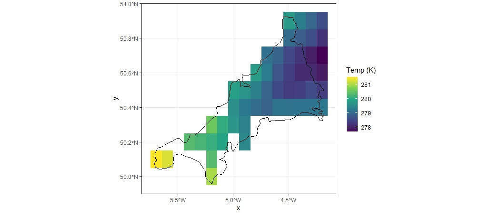
</center>


Next we will plot a variable over time  (*note: This takes a lot of fiddling with the NetCDF file*)

```{r, eval=FALSE}
our_nc_data <- nc_open("data_stream-mnth.nc")
print(our_nc_data)
attributes(our_nc_data$var)
attributes(our_nc_data$dim)
lat <- ncvar_get(our_nc_data, "latitude")
nlat <- dim(lat) 
lon <- ncvar_get(our_nc_data, "longitude")
time <- ncvar_get(our_nc_data, "valid_time")
head(time)

## Tells you what the time units are - 
## these are funky, check it out!
tunits <- ncatt_get(our_nc_data, "valid_time", "units")

time_obs <- as.POSIXct(time, origin = "1970–01–01", tz="GMT")
origin <- sub(".*since ", "", tunits)
#as.numeric(as.character("1609459200"))

# convert time -- split the time units string into fields
t_ustr <- strsplit(tunits$value, " ")
t_dstr <- strsplit(unlist(t_ustr)[3], "-")
date <- ymd(t_dstr) + dseconds(time)
time<-date

t2m_array <- ncvar_get(our_nc_data, "t2m") 
fillvalue <- ncatt_get(our_nc_data, "t2m", "_FillValue")
t2m_array[t2m_array==fillvalue$value] <- NA

tp_array <- ncvar_get(our_nc_data, "tp") 
fillvalue_tp <- ncatt_get(our_nc_data, "tp", "_FillValue")
tp_array[tp_array==fillvalue_tp$value] <- NA

lonlattime <- as.matrix(expand.grid(lon,lat,time))
head(lonlattime)

t2m_vec_long <- as.vector(t2m_array)
tp_vec_long <- as.vector(tp_array)

t2p_obs <- data.frame(cbind(lonlattime, t2m_vec_long, tp_vec_long))
head(t2p_obs)

#change column names
colnames(t2p_obs) <- c("Long","Lat","Date","t2m", "tp")

#This is a very ugly plot, but you can make it functional 
## - this is over 40K data points on a plot
  ggplot(data=t2p_obs, aes(x=Date, y=t2m)) +
  geom_point(size=1) +
  geom_line(size=0.5) +
  labs(title="Time series of monthly avearaged hourly
       temperature (K) in Cornwall from ERA-5, 2022", 
       x = "Year",
       y = "Mean Temperature (°K)")
```


# Section 4: Additional climate resources and caveats

## EO vs Weather station data

EO - Earth Observation - primarily satellite data - from 'looking down' onto things (also called EOS data - earth observation system data)

LST - land surface temperature is reflectance converted to temperature via algorithms

What if it's a forest? What is your vector experiencing?

What if there's lots of clouds? What if cloud cover prevents accurate readings in a systematic way, e.g. at certain times of year?

Lots of products available, always a lag because someone has to process and QA/QC before you can use it

## Weather Station Data

Point based data that often gets interpolated to represent irregular region shapes - great if you have lots of stations, less great with sparse coverage.

Requires people to record data at some step of the way; gaps can occur on holidays, larger gaps during natural disasters - know what missing data protocols are within the dataset.

Geography (where in the world) very much influences coverage and quality. Tracking down what the nearest weather station is takes a little time (look on NOAA, WMO), but getting those data can sometimes be complicated.

Much of weather data is collected and recorded for commercial purposes. Your access to those data is not guaranteed.

Today we have reviewed a few concepts and products - there are TONS out there.

***Starting points are:***

NOAA - lots of gridded products as well as weather stations

NASA - lots of processed EO data from many missions with many spatiotemporal resolutions and utility

ERA - large climate modeled runs and even counterfactuals

Copernicus - European entry point for gridded and processed data sets, model outputs

## Some climate resources

### PRISM (Parameter-elevation Regressions on Independent Slopes Model)

[https://prism.oregonstate.edu/data/](https://prism.oregonstate.edu/data/)

- Gridded data for the continental/contiguous/coterminus US (CONUS)
- Hosted at Oregon State
- Daily 1981-present; monthly and annual 1895-present
- 800m and 4km – currently both free to download
- Uses 10k+ station data as inputs
- Trusted product – USDA hardiness zones, e.g.
- R package ‘prism’ API (https://docs.ropensci.org/prism/)

<center>
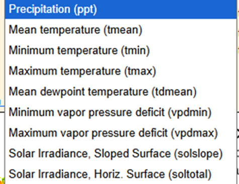
</center>

------------------------------------------------------------------------

### DAYMET

[https://daymet.ornl.gov/](https://daymet.ornl.gov/)

- Data product interpolated and extrapolated from daily meteorological observations
- Useful in the USA – does include PR and HI
- Daily, 1km scale, a year in arears (current through 12-31-25)

<center>
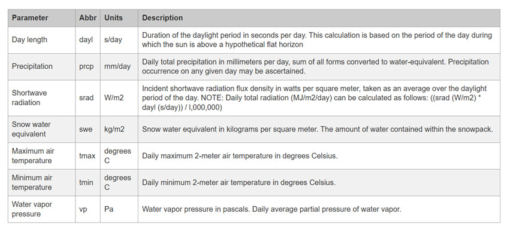

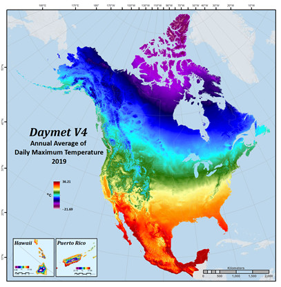
</center>

------------------------------------------------------------------------

### Terra Climate – Climatology Lab

[https://www.climatologylab.org/terraclimate.html](https://www.climatologylab.org/terraclimate.html)

- Monthly climate and climatic water balance for global terrestrial surfaces from 1950-present
- 4km resolution
- Global scale
- Many climate variables

<center>
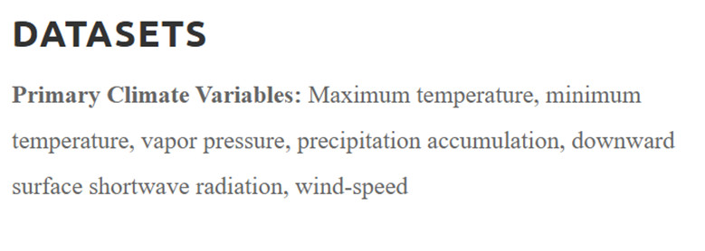

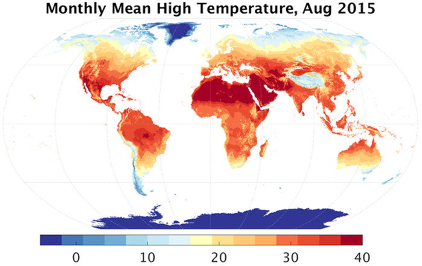
</center>

------------------------------------------------------------------------

### gridMET – Climatology Lab

[https://www.climatologylab.org/gridmet.html](https://www.climatologylab.org/gridmet.html)

- 4km resolution
- Contiguous US and southern British Columbia
- Daily from 1979 - Present
- Many primary climate and derived variables

<center>
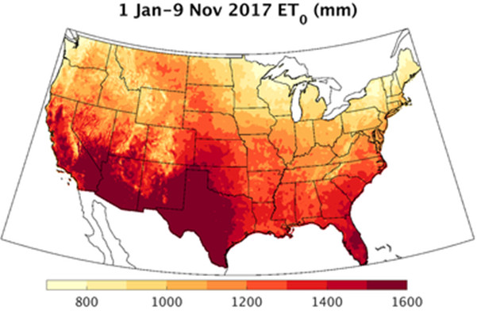
</center>

------------------------------------------------------------------------

### WorldClim

[https://www.worldclim.org](https://www.worldclim.org)

- Climate normals - 20-30 year periods and projections
- Monthly means; basis for bioclim variables originally - widely used, also originally used PRISM-like interpolated data
- Multiple resolutions 1km, 4km, etc - modeled, not more data addition
- Useful for easy flexible comparisons across landscapes, for climate scenario comparisons, ecological modeling

------------------------------------------------------------------------

### Landsat Collection Surface Temperature

[https://earthexplorer.usgs.gov](https://earthexplorer.usgs.gov)

- Remotely sensed satellite imagery
- Global coverage
- Available from 1982 - Present (mission specific)
- Represents the temperature of the Earth’s surface in Kelvin
- Available at a 30m spatial resolution
- Freely available after creating account for USGS EarthExplorer
- Rasters typically need processing for QC (e.g., removal of cloud cover)

<center>
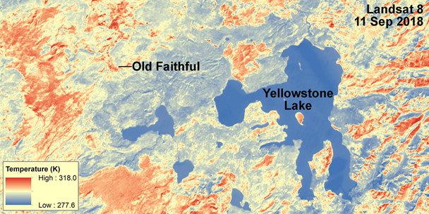
</center>


