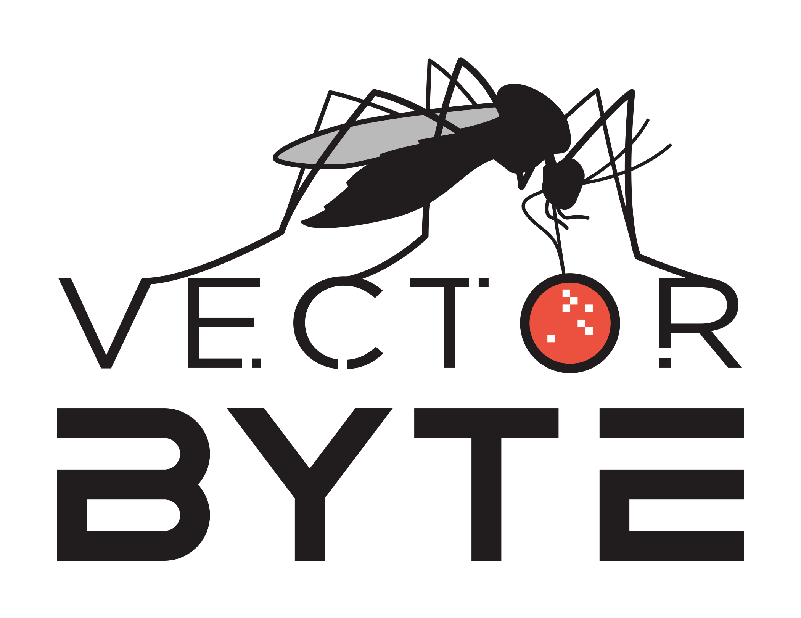

::: columns
::: {.column width="30%"}

[{fig-alt="VectorByte Logo"}](https://www.vectorbyte.org)

:::

::: {.column width="5%"}

:::

::: {.column width="65%"}

***Check out our [about](about.qmd) and [schedule](schedule2026.qmd) pages to continue.***

Information about pre-workshop preparation -- including software installation, expectations for what you should already be familiar with, and review materials -- is available in the [pre-work portion of the materials page](materials.html#pre-work-and-set-up).

     

:::

:::

::: columns
::: {.column width="62%"}

This year we are partnering with the [Ecology and Evolution of Infectious Diseases Conference](https://cpe.vt.edu/eeid2026.html). The VectorByte workshop will run concurrently with the EEID training workshop, and will explore some topics jointly. 

We will also be sharing meals and presenting mini-projects, to provide opportunities for networking by participants.

:::

::: {.column width="1%"}

:::

::: {.column width="37%"}

 

[{fig-alt="EEID 2026 Logo"}](https://cpe.vt.edu/eeid2026.html)

:::

:::
