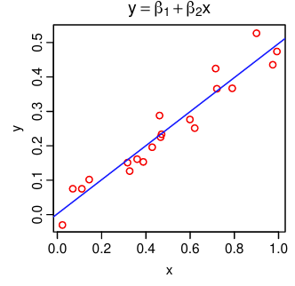
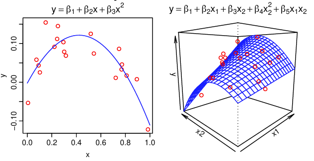
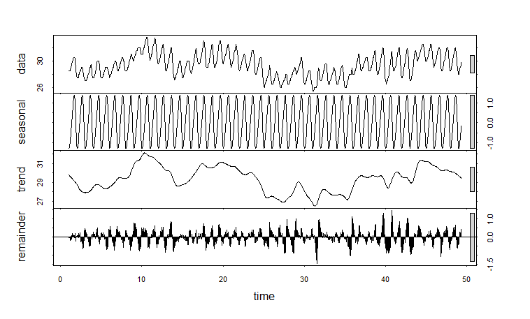
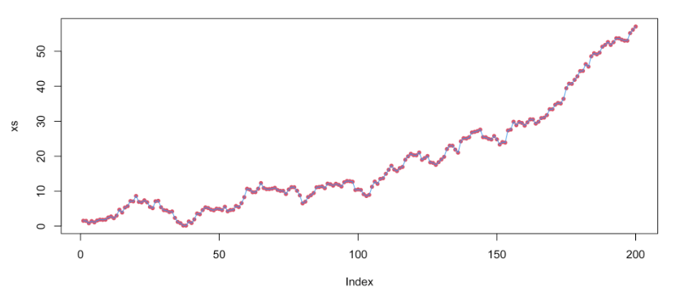
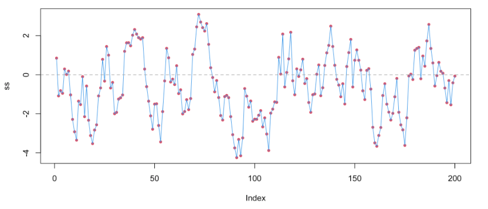
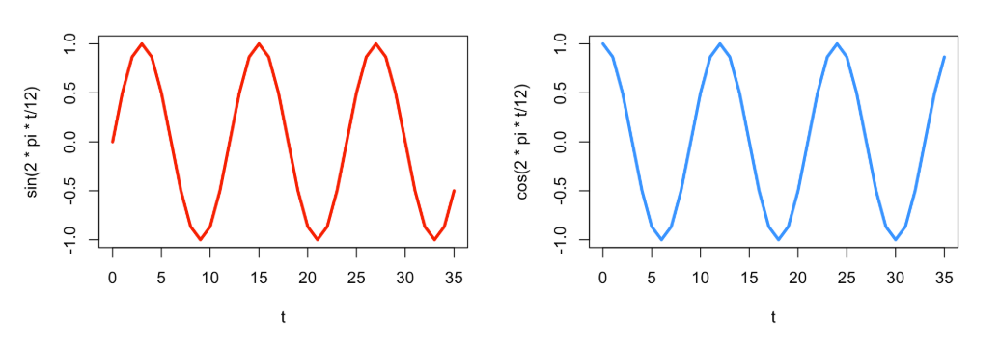

```{r, echo = F}
library(tidyverse)
```

# Linear Regression for Time Series Data

## Linear Regression Basics

Remember that simple linear regression fits a straight line through data by minimizing the distance between the fitted line and the actual data points (Ordinary Least Squares approach we explored in the NLLS session).

{fig-align="center" width="283"}

While we often use a straight line for demonstration, also remember that linear models can be used to model data that doesn't *look* linear by incorporating higher order terms or using categorical predictors.

{fig-align="center"}

Linear regression comes with certain assumptions about our data, and we check that the fitted model meets those assumptions using graphical methods or tests. Those assumptions are:

1.  Linearity: there is a straight line relationship between the predictors and the response
2.  Normality: the residuals are normally distributed
3.  Homoscedasticity: the residuals have constant variance
4.  [**Independence: observations are independent of one another**]{.mark}

Independence of observations means that the value of one observation does not contain information that would help us predict the next observation. For example, if we were to measure the weights of 100 random, unrelated bears, there is no reason to think that one bear's weight would help us predict the next bear's weight with any particular accuracy. On the other hand, if we were to measure those same bears on a monthly basis for 5 years to follow their weight gain before hibernation, their weights in March would be heavily dependent on their weights in January. In other words, the heaviest bears often remain the heaviest over time.

::: callout-tip
## Side Quest: Fat Bear Week

[Fat Bear Week Hall of Fame](https://www.nps.gov/katm/learn/nature/fat-bear-week-past-and-present.htm)
:::

## Time Series Data

There are many kinds of data that do not fit the independence assumption, but time series cases like the bear example are a common example. Data that are collected on the same individual, population, or system over time inherently carry information about the data that will be collected in the future. While this poses a challenge for linear regression modeling, it also serves as a source of information that we as modelers can capitalize on!

::: callout-important
## Time-Dependent vs. Time Series Data

Time-dependent data include any data where the relationship between the predictors and response changes over time. All time-dependent data violates the independence assumption of linear regression and requires special additions to the models to accommodate the time-dependence.

Time series data is one type of time-dependent data. Time series data refers to data collected at evenly spaced intervals over time with no missing data - sounds nice, right? 😆 In vector-borne disease research we are rarely able to produce such perfect data sets, so many time series methods cannot be used directly with our data. However, methods exist to adapt time series models to these *almost* time series data sets.
:::

### Example: Air temperature in New York

This graph shows daily air temperature measurements in New York from May to September in a given year. Notice how day-to-day temperatures from nearby days are generally more similar than temperatures on days that are farther away from each other.

```{r}
nyTemps <- data.frame(time = seq(1,nrow(airquality),1),
                      temp = airquality$Temp)

ggplot(data = nyTemps, aes(x = time, y = temp))+
  geom_line()
```

### Example: Monthly UK deaths due to lung infection

This graph shows the monthly number of deaths from lung infection in the UK from 1947-1979. Notice how a yearly pattern seems to emerge.

```{r}
ld<-as.vector(ldeaths)
plot(ld, xlab="month", ylab="deaths", type="l", 
     col=4, lwd=2)
```

We call the relationship between time series observations *autocorrelation.* This just means that one observation is correlated with (or related to) the next one. We can visualize and quantify the amount of autocorrelation between observations. A simple way to observe autocorrelation in our data is to plot the response ($Y$) against the responses from the previous time point ($Y_{t-1}$).

```{r}

# Build a data set with the deaths data and the lag-1 response
autoDat <- data.frame(time = seq(1, length(ldeaths),1),
                      deaths = as.vector(ldeaths),
                      lagDeaths = lag(as.vector(ldeaths),1))

# Remove the NA value that is introduced
autoDat <- autoDat %>% na.omit(lagDeaths)

# Calculate the autocorrelation
corr <- round(cor(autoDat$deaths, autoDat$lagDeaths), 2)

# Plot the relationship between deaths this month and last month
ggplot(data = autoDat, aes(x = deaths, y = lagDeaths))+
  geom_point()+
  annotate("text",
           x = 1500, y = 3800, label = paste("corr = ", corr ),
           color = "red")

```

There is a clear linear relationship between the deaths this month and the deaths last month. This is a perfect example of autocorrelation. Values that are further apart can also be autocorrelated. We can visualize the relationships between the current value and all previous ones using an autocorrelation function (ACF) plot. We call it an ACF plot because the autocorrelation function is just:

$$
r(\ell) = cor(Y_t, Y_{t-\ell}),
$$

where $Y_{t-\ell}$ is the lag-$\ell$ response value. In other words, we compute the correlation between the current response and each of the previous ones. Let's look at an ACF plot for the lung infection deaths data and the New York temperature data.

```{r}
# Deaths data
acf(ldeaths)
```

The seasonal pattern is even more apparent in this plot!

```{r}
#NY Temps data
acf(airquality$Temp)
```

We can see how "sticky" the temperature data are. The temperatures are still moderately correlated 7 days apart!

So how do we make use of this additional information (that we often work really hard to get)? We can add structures to our linear regression models to capture the autocorrelation present in our data.

::: callout-note
## Modeling Goals for Time Series Data

The way we approach modeling time series data (and data in general) often depends on what we hope to do with the model once we fit it. Modeling goals fall into two broad categories:

#### Inference

When we want to extract information about a system as it exists now or existed in the past, our goal is to use the model for *inference*. In this case, we may choose to focus more on the validity of the model within the data we already have. This helps us to characterize structures of interest within the data set (e.g. seasonal patterns, annual trends).

{fig-align="center" width="507"}

#### Prediction

When we want to anticipate how a system will exist in the future, our goal is to use the model for *prediction*. In this case, we may choose the focus more on how well the model predicts responses from data we did not use to fit the model. This helps provide an idea about how the model will predict the future, which can be especially useful for people in resource management positions.

.](graphics/clipboard-2136995412.png){fig-align="center" width="538"}

Our practical will focus primarily on the inferential case.
:::

## Time-Dependent Linear Regression

With some small adjustments, we can make linear regression models appropriate for time series data. Remember the basic linear regression model:

$$
Y_i = \beta_0 +\beta_1X_i + \varepsilon_i
$$

$$
\varepsilon_i \overset{\text{iid}}{\sim} \mathcal{N}(0, \sigma^2),
$$

where $Y_i$ is the the $i$th response observation and $X_i$ is the $i$th predictor observation in the data set, $\beta_0$ is the fitted intercept, and $\beta_1$ is the fitted coefficient associated with $X$. The residuals are identically and independently distributed.

#### Time-dependent Regression

The simplest thing we can do is to add time as a predictor variable into the model. When we do this, we are accounting for "trends" in the data. Trends are the general pattern or shape over time. Just like any other predictor, we can use transforms of the time variable as well to capture relationships that are not in a straight line.

Let's look at this using the NY weather example.

```{r}
# Fit the model with time as a predictor
tempreg <- lm(temp ~ time, data = nyTemps)

# Check out the summary
summary(tempreg)
```

The residuals will tell us whether there is any leftover information we haven't considered. Let's look at some basic residual plots.

```{r}
# Histogram to check for normality - looks great!
hist(tempreg$residuals)

# Predicted vs. Residuals plot to look for patterns - definitely something going on here!
plot(tempreg$residuals, predict(tempreg))
```

The residuals vs. predicted plot shows a clear pattern. That means we left some information out of our model. Remember how the time series was shaped from earlier?

```{r, echo = F}
ggplot(data = nyTemps, aes(x = time, y = temp))+
  geom_line()
```

It was slightly curved. We might need to add a quadratic term to help account for that. Let's do that and look at the plot again.

```{r}
# Add time^2 to the data set
nyTemps$timeSq <- nyTemps$time^2

# Fit the model with time as a predictor
tempreg2 <- lm(temp ~ time + timeSq, data = nyTemps)

# Check out the summary - the squared term is significant!
summary(tempreg2)

# Predicted vs. Residuals plot to look for patterns - better but still weird
plot(tempreg2$residuals, predict(tempreg2))
```

There is still something not quite right with our model. We can use the residuals to check whether there is autocorrelation between the observations we have not dealt with in our model (spoiler alert: there is 🙃). Let's look at an ACF plot of the residuals.

```{r}

acf(tempreg2$residuals)
```

Woah! We definitely still have some autocorrelation in our errors, which means we are in violation of the independence assumption. Our model needs more work.

#### Autoregressive Terms

We can adjust this model set up slightly to account for autocorrelation between observations. If we replace the $i$ with a $t$ for time and think about our $X$ variable as the lag-1 response (the response from the previous time point), we can re-write this model as

$$
Y_t = \beta_0 +\beta_1X_{t-1} + \varepsilon_t
$$

$$
\varepsilon_t \overset{\text{iid}}{\sim} \mathcal{N}(0, \sigma^2)
$$

We can expand this model to include more lags of the response if necessary and we can add other predictors of interest into the model as well. Notice that all the same assumptions about the residuals still apply when we perform this kind of regression.

Let's add in the 1-day lagged temperature as a variable and see if the fit is better

```{r}
# Add a lag-1 response to the data set
nyTemps$tempLag1 <- lag(nyTemps$temp,1)

# Get rid of the NA that was introduced
nyTemps <- nyTemps %>% na.omit(tempLag1)

# Fit our autoregressive regression model
tempregAuto <- lm(temp ~ time + timeSq + tempLag1, data = nyTemps)

# The lag is significant as expected!
summary(tempregAuto)

```

::: callout-note
## Exploding Time Series?? TAKE COVER

When the coefficient associated with an autoregressive variable is greater than 1, we call the time series an "exploding series", because this means that the observations are going to become exponentially far away from one another over time. In this case, an autoregressive term is often not very useful in our model.

{fig-align="center"}

On the other hand, when the coefficient is less than 1, the series is likely "stationary". This means that the values tend to move back toward the mean value when they start to get far away from the mean. In these cases, autoregressive terms are very useful and informative.



In our model, the coefficient was about 0.64, so the NY temperatures tend to regress toward the mean value over time!
:::

We can see that the lagged temperature variable is highly significant in our model as we expected! Interestingly, the trend now seems less important. Let's look at the residuals to see if we took care of the autocorrelation.

```{r}

# Make an ACF plot of the residuals
acf(tempregAuto$residuals)

```

There is no significant autocorrelation left in the residuals (none of the lines other than the first one go outside the blue lines)! Great! We can still evaluate the other typical residual plots to make sure the other assumptions are met. Let's look at those.

```{r}
# Histogram to check for normality - looks great!
hist(tempregAuto$residuals)

# Predicted vs. Residuals plot to look for patterns - looks a lot better! No clear patterns
plot(tempregAuto$residuals, predict(tempregAuto))

```

::: callout-tip
#### Try it out!

We can add additional lags of the response to improve the model further and account for more autocorrelation when appropriate. **On your own, try adding other lags into the model and look at the results!**
:::

#### Seasonality

Another common feature of time series data is seasonality. Seasonal patterns occur when observations taken at the same time of day, week, month, or year are similar to one another. It creates a "wavy" pattern in the data, like the lung infection deaths example from before. This kind of pattern is very common in arthropod abundance time series, so we will explore ways to deal with it in regression models!

```{r, echo = F}
ld<-as.vector(ldeaths)
plot(ld, xlab="month", ylab="deaths", type="l", 
     col=4, lwd=2)
```

There are a few ways of accounting for seasonality in regression models. Which one to choose depends heavily on your modeling goal. If you want to do post hoc comparisons between seasons or you only have a short time course available, it is usually the most straightforward to use a categorical seasonal variable (e.g. month or year). This is also useful if the seasonal pattern is not smooth and jumps around.

The drawback to this approach is the number of dummy variables that will be introduced to the model. For example, if my data show annual seasonality, I may need to use 11 dummy variables (one for each month of the year with one accounted for in the intercept). If your sample size is small, this can cause a problem.

On the other hand, if you want to simply account for seasonality so you can focus on other information in the data, we can use trigonometric (sine and cosine) seasonality terms. We can represent any smooth periodic function as the sum of sines and cosines. Remember what the sine and cosine functions look like? They repeat every period ($\frac{2\pi}{k}$).



It can be harder to directly compare these continuous functions to say that one season is statistically warmer than another, for example, but they require only 2 degrees of freedom! Adding these into the linear regression model from earlier looks like

$$
Y_t = \beta_0 + \beta_1sin\left(\frac{2\pi t}{k}\right) + \beta_2cos\left(\frac{2\pi t}{k}\right)+ \varepsilon_t,
$$

where $k$ is the number of times the cycle repeats in a single period. For example, for monthly data, $k$ = 12 implies an annual cycle. However for daily data, $k$ = 365 implies an annual cycle. Let's try this approach with the lung infection deaths data.

```{r}
# Create a time variable in the ldeaths data
tmax<-length(ldeaths)
t <- 2:tmax

# Create a data frame with the sine and cosine terms
YX <- data.frame(ld=ld[2:tmax], ldpast=ld[1:(tmax-1)], t=t,
                 sin12=sin(2*pi*t/12), cos12=cos(2*pi*t/12))

# Fit the model
lunglm <- lm(ld ~ t + ldpast + sin12 + cos12, data=YX)

# The seasonal terms are significant!
summary(lunglm)

# Residual plots
hist(lunglm$residuals) # looks okay

plot(predict(lunglm), lunglm$residuals) # looks okay

acf(lunglm$residuals) # Maybe a little left over, but okay
```

Let's look at how well the model fits the data.

```{r}
# Add predicted values
YX$preds <- predict(lunglm)

# Plot
ggplot(data = YX, aes(x = t))+
  geom_line(aes(y = ld), color = "lightblue", linewidth = 1.5)+
  geom_line(aes(y = preds), color = "indianred", linewidth = 1.5, linetype = 2)+
  theme_bw()
```

::: callout-tip
## A note on incomplete or inconsistent time series

The methods we discussed here work when we have a complete data set and when the observations are made at consistently spaced time points. Unfortunately, we rarely are so lucky in the biological data space. Luckily, there are ways of modeling 'less than perfect' time series data sets. We will not discuss these in detail, but some ways are to:

1.  Use categorical time variables instead of continuous ones
2.  Smoothing and imputation
3.  Using time-dependent covariates (stay tuned for more on this in another module!)
:::

## Automated Fitting Pipelines

In cases where we expect to keep generating new data in a data set or where we expect to perform the same analyses on multiple data sets of similar structure in the future, it can be useful to set up automated and reproducible pipelines for cleaning data and fitting models. We can even produce full reports with text that updates when new data are introduced.

In the next activity, we will use the VecDyn API to access mosquito population data collected over several years in Suffolk, VA to produce a report that explores and models the data. These data continue to be collected, so there's a good chance we would want to repeat any analyses we did with these data in the future.

Download and open the [reproducibleReport.qmd](reproducibleReport.qmd) file to get started using the skills you learned in this practical to build a simple reproducible report!
